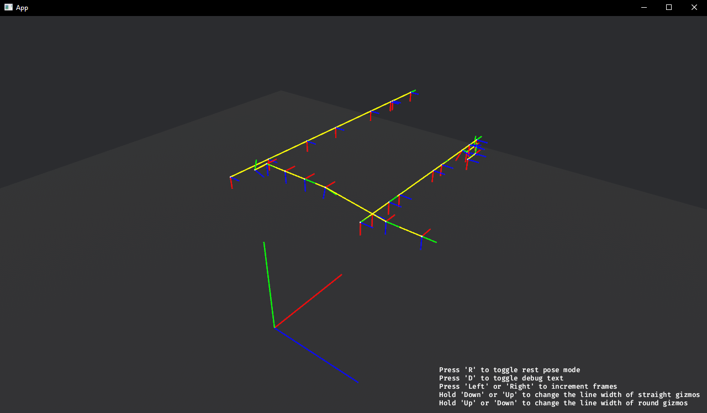

# Parsing .bvh animation files 💀
A Rust library for parsing .bvh files. It not only parses the HIERARCHY and MOTION, but additionaly calculates implicit properties such as global joint positions and rotations, both for the pose (MOTION section) and the rest pose (HIERARCHY section). 

## Install
Base package:  
`cargo add bvh_anim_parser`

To enable visualization using a `bevy` app:  
`cargo add bvh_anim_parser --features visualize`

## Usage/documentation

See `examples/example.rs` for an exhaustive usage. This crate offers nothing more than what's presented in that file.

Currently, modifying and writing .bvh files is not supported (let me know if that's something you need).

### Visualization (`bevy` app)
The 3 red, green, blue vectors can be associated with the global pose rotations (3 column-vectors of 3x3 rotation matrix). Their origin is literally the global pose position.

By pressing "R" you can also view the rest pose with its global rest rotations and positions.

## Codebase structure
- `src/types.rs` contains all the custom structs and types.
- `src/parse.rs` contains all the functions involved in parsing bvh files and getting additional info. from them.
- `src/visualize.rs` is a `bevy` app for visualizing loaded .bvh files. It's purpose was to help me ensure the bvh parser produces sensible results.

There are 2 main structs: `BvhMetadata` and `BvhData`. `BvhData` contains numerical data (in the form of 1D and 2D vectors) of positions and rotations of each joint at each frame (both for pose and rest pose). `BvhMetadata` contains info. such as frame count, fps and joint indices for extracting data out of `BvhData`.

## Convetions
- right handed Y-up coordinate system

## Assumptions (no warnings/errors will be given if you violate these!):
1. Only one animation (the legend says, you can embed multiple animations into a single .bvh) per .bvh file allowed.
2. Hips have translational and rotational components (6 channels), while all the other joints only the rotational one (3 channels). 
3. All rotational components have the same rotation order. For example, if one joint has YZX order while some other has XYZ, then the parser will parse the rotations incorrectly.
4. The non-ENDSITE joint names must not start with the regex 'end*' (case insensitive) - this pattern is used to recognize ENDSITEs.
5. One "\{" or "\}" per line (i.e newlines matter).

## FAQ
####  How are rest pose global joint rotations calculated?
Inspect `__get_tail_offset(...)` function in `src/parse.rs`. It returns the "forward" vector, which is then used to calculate rotation (using cross products, etc.).

## Other repos
- https://github.com/Wasserwecken/bvhio (Python) - A great .bvh parsing library I've used frequently, and that inspired me to write my own .bvh parser. However, it's not as fast as I would like for large dataset processing. 
- https://github.com/burtonageo/bvh_anim/tree/master (Rust) - The highest starred Rust .bvh parser. Seems overengineered and doesn't provide anything that's not already in the HIERARCHY or MOTION section (i.e. doesn't compute rest pose orientations, doesn't do forward kinematics, therefore you can't get global joint positions/rotations, etc.) 

## Contributing
Everyone's welcome. Smash that "New issue" button.

## Roadmap
- modifying and writing .bvh files
- fast serialization and deserialization to disk
- multithreaded parsing (especially when doing forward kinematics or when parsing MOTION section)
- ... your ideas? :)